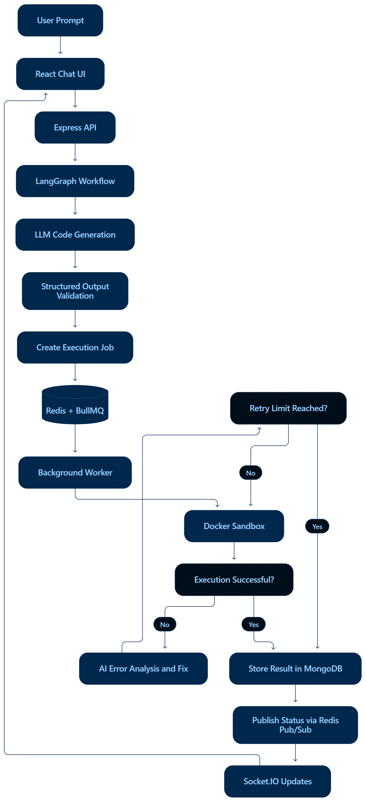

# AI Sandbox

An AI-powered coding agent that converts natural-language requests into code, executes it in isolated Docker containers, and attempts to fix execution errors automatically.

## Features

* **AI Code Generation:** Generates structured code from natural-language prompts.
* **Multi-language Execution:** Supports Java, JavaScript, Python, and C/C++.
* **Automated Error Correction:** Uses an AI-driven workflow to analyze execution errors and attempt fixes.
* **Asynchronous Processing:** Uses Redis and BullMQ to process execution jobs through background workers.
* **Real-time Updates:** Streams execution status and results to the frontend.
* **Execution Isolation:** Runs generated code inside resource-constrained Docker containers.
* **Chat History:** Maintains conversations and execution history.

## Tech Stack

* **Frontend:** React, Vite, Tailwind CSS
* **Backend:** Node.js, Express
* **AI Orchestration:** LangChain, LangGraph
* **Queue:** Redis, BullMQ
* **Database:** MongoDB
* **Execution:** Docker
* **Real-time Communication:** Socket.IO

## Architecture

1. The user submits a natural-language coding request.
2. LangGraph orchestrates code generation and validation.
3. The backend queues execution jobs for background workers.
4. Workers execute generated code inside Docker containers.
5. Execution errors can trigger an automated correction loop.
6. The frontend receives status updates and displays the results.

## Architecture



## Getting Started

Clone the repository:

```bash
git clone https://github.com/ykaran01/AI_Sanbox_project.git
cd AI_Sanbox_project
```


Install the backend and frontend dependencies in their respective directories, configure the required environment variables, and start the application services.

Docker and Redis are required for the execution and job-processing components.

## Security

Generated code is untrusted. Container isolation and resource limits help reduce execution risks but do not guarantee complete sandbox security.
